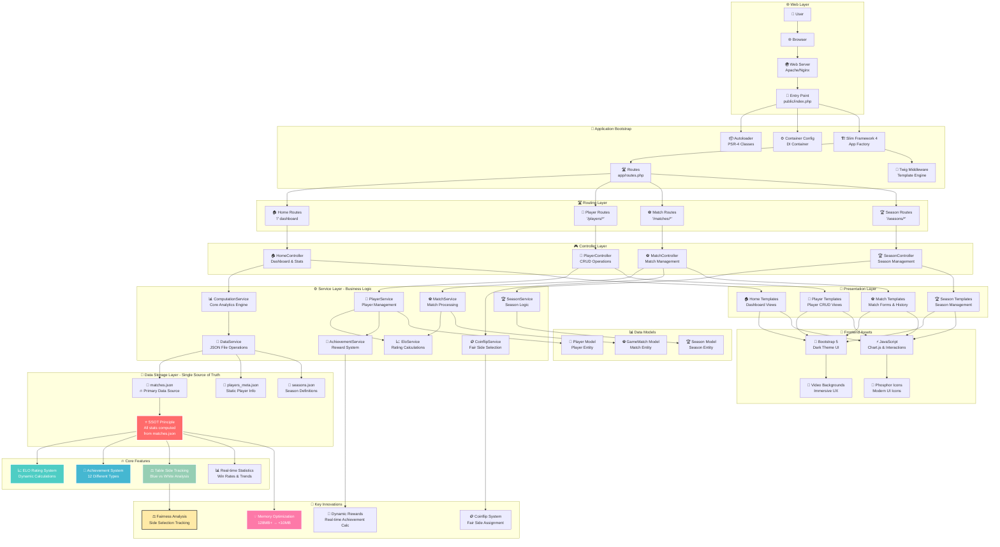

# 🏗️ Kickerliga System Architektur

## 📊 Architektur-Diagramm

Dieses Diagramm zeigt die vollständige Systemarchitektur der Kickerliga Management System mit allen wichtigen Komponenten und Datenflüssen.

## 🏗️ Architektur-Übersicht

### 🔥 Kern-Innovation: Single Source of Truth (SSOT)
- **Zentrale Datenhaltung**: Alle Spielerstatistiken, ELO-Ratings und Achievements werden in Echtzeit aus `matches.json` berechnet
- **Datenintegrität**: Eliminiert Dateninkonsistenzen durch einheitliche Datenquelle
- **Speicher-Optimierung**: Reduziert Speicherverbrauch von 128MB+ auf <10MB
- **Sicheres Löschen**: Ermöglicht sicheres Löschen von Matches mit automatischer Neuberechnung aller abhängigen Daten

### 🚀 Hauptkomponenten

#### **Web Layer**
- Standard Webserver-Setup mit Slim Framework 4 als Einstiegspunkt
- PSR-4 Autoloading und Dependency Injection Container

#### **Routing & Controller**
- **4 Hauptbereiche**: Home (Dashboard), Players, Matches, Seasons
- Jeder Controller verwaltet CRUD-Operationen für seinen Bereich

#### **Service Layer** (Business Logic)
- **ComputationService**: Zentrale Analytics-Engine für SSOT-Datenverarbeitung
- **EloService**: Implementiert dynamisches ELO-Rating mit Tordifferenz-Modifikatoren
- **AchievementService**: Verwaltet 12 verschiedene Achievement-Typen
- **CoinflipService**: Bietet faires Tischseiten-Auswahlsystem
- **DataService**: Verwaltet JSON-Dateioperationen mit File-Locking

#### **Datenspeicherung**
- **JSON-basierte Speicherung** statt traditioneller Datenbanken
- **matches.json**: Primäre Datenquelle mit allen Match-Aufzeichnungen
- **players_meta.json**: Statische Spielerinformationen (Namen, etc.)
- **seasons.json**: Saison-Definitionen und -Konfigurationen

## 🔥 Erweiterte Features

1. **⚖️ Tischseiten-Tracking**: Umfassende Blau vs. Weiß Seiten-Analyse für Fairness
2. **🪙 Coinflip-System**: Interaktive faire Seitenauswahl mit Animationen
3. **📈 ELO-Rating**: Dynamische Berechnungen mit Tordifferenz-Boni
4. **🏅 Achievement-System**: 12 verschiedene Belohnungstypen mit Echtzeit-Berechnung
5. **📊 Echtzeit-Analytics**: Alle Statistiken werden on-demand aus Match-Daten berechnet
6. **🎨 Moderne UI**: Bootstrap 5 Dark Theme mit Video-Hintergründen und Chart.js-Visualisierungen

## 📝 Verwendung des Diagramms

Dieses Diagramm kann verwendet werden für:
- **Entwickler-Onboarding**: Schnelles Verständnis der Systemarchitektur
- **Code-Reviews**: Referenz für Architektur-Entscheidungen
- **Dokumentation**: Visuelle Erklärung des Systems für Stakeholder
- **Refactoring**: Identifikation von Abhängigkeiten und Optimierungspotential

## 🔗 Verwandte Dokumentation

- [Hauptprojektdokumentation](project.md)
- [Single Source of Truth Feature](feature-single-source-of-truth.md)
- [ELO-System Details](elo-system.md)
- [Achievement-System](achievements.md)
- [Tischseiten-Tracking](feature-tischseiten-tracking.md)

---

*Generiert am: ${new Date().toLocaleDateString('de-DE')} für Kickerliga Management System v1.0* 